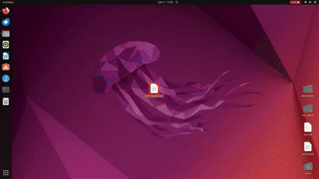

<p align="center">
  
</p>


# 🖥️ CUA — Computer Use Agent OS(With Local Sandbox)

A locally-running AI agent that autonomously controls a virtual desktop inside a Docker container using the **Qwen3-VL** vision-language model. The user issues natural language commands; the agent analyzes live screenshots of the VM, plans multi-step actions, and executes mouse/keyboard inputs to accomplish the task — all running on your own hardware with no cloud APIs required.


## 🎬 Demo




## 🎯 What Is This?

Most "computer use" demos rely on cloud-hosted models (GPT-4V, Claude, etc.). This project runs the **entire pipeline locally**:

1. A **Docker container** (`trycua/cua-xfce`) provides a full XFCE Linux desktop accessible via VNC and a REST API.
2. A **Planner model** (text-only GGUF, e.g. Octopus-Planning Q5_K_M) breaks down complex user objectives into atomic, verifiable steps.
3. A **Qwen3-VL 8B** vision-language model (GGUF format, accelerated on your NVIDIA GPU via `llama-cpp-python`) looks at the VM's screen, executes each step, and verifies success.
4. A **PyQt6 Mission Control UI** lets you issue commands, watch the agent work in real-time, inspect each step, and intervene when needed.

**Hierarchical Agent Loop:**
```
User Objective
  → Planner (text-only GGUF) → [Step 1, Step 2, Step 3, ...]
    → For each step:
        Screenshot → Executor (Qwen3-VL) → Action (click/type/scroll)
        Screenshot → Verifier (Qwen3-VL) → Pass/Fail
    → All steps done → Objective complete
```

## ✨ Features

- **Qwen3-VL 8B** vision-language model (GGUF, runs locally on GPU)
- **Docker Sandbox** — isolated virtual desktop via `trycua/cua-xfce` container
- **Hierarchical Planning** — local GGUF planner decomposes complex objectives into atomic steps, verified after execution
- **Local Model File Browser** — browse and select local `.gguf` model files directly from the GUI, or download from HuggingFace
- **Auto GPU Layer Detection** — automatically detects available VRAM and calculates optimal GPU offloading
- **Mission Control UI** — professional 5-panel PyQt6 interface with planner settings panel
- **Live VM Screen** — direct mouse/keyboard interaction with the VM
- **Agent Trace** — step-by-step plan visualization, metrics, structured logs
- **Plan Verification** — each plan step is verified against success criteria using the vision model
- **Safety Guards** — repeat detection, coordinate validation, step limit
- **Turkish → English Translation** — commands are auto-translated (optional)
- **JSON Log Export** — export structured logs for debugging/analysis

## 📋 Requirements

| Component | Minimum |
|-----------|---------|
| **OS** | Ubuntu 22.04+ |
| **Python** | 3.10 |
| **GPU** | NVIDIA with CUDA support (8 GB+ VRAM recommended) |
| **NVIDIA Driver** | 535+ |
| **Docker** | 24.0+ |
| **RAM** | 16 GB+ recommended |

## 🚀 Installation from Scratch

### 1. NVIDIA Driver

Check if the driver is installed:
```bash
nvidia-smi
```

If not installed:
```bash
sudo apt update
sudo apt install -y nvidia-driver-535
sudo reboot
```

### 2. Docker

```bash
# Install Docker Engine
sudo apt update
sudo apt install -y ca-certificates curl gnupg
sudo install -m 0755 -d /etc/apt/keyrings
curl -fsSL https://download.docker.com/linux/ubuntu/gpg \
  | sudo gpg --dearmor -o /etc/apt/keyrings/docker.gpg
echo "deb [arch=$(dpkg --print-architecture) signed-by=/etc/apt/keyrings/docker.gpg] \
  https://download.docker.com/linux/ubuntu $(. /etc/os-release && echo $VERSION_CODENAME) stable" \
  | sudo tee /etc/apt/sources.list.d/docker.list > /dev/null
sudo apt update
sudo apt install -y docker-ce docker-ce-cli containerd.io

# Allow running Docker without sudo (re-login required)
sudo usermod -aG docker $USER
newgrp docker

# Verify
docker run --rm hello-world
```

### 3. Pull the Sandbox Container

```bash
docker pull trycua/cua-xfce:latest
```

### 4. Create Conda Environment

If Miniconda is not installed:
```bash
wget https://repo.anaconda.com/miniconda/Miniconda3-latest-Linux-x86_64.sh
bash Miniconda3-latest-Linux-x86_64.sh
# Close and reopen your terminal
```

Create and activate the environment:
```bash
conda create -n cua python=3.10 -y
conda activate cua
```

### 5. Install PyTorch (CUDA 13.0)

```bash
pip install torch torchvision --index-url https://download.pytorch.org/whl/cu130
```

> **Note:** For different CUDA versions, visit https://pytorch.org/get-started/locally/

### 6. Install llama-cpp-python (NVIDIA GPU — Prebuilt Wheel)

The standard `pip install llama-cpp-python` **does not include CUDA support**. To run on an NVIDIA GPU, use a prebuilt wheel from the JamePeng fork:

1. Go to https://github.com/JamePeng/llama-cpp-python/releases
2. Download the `.whl` file matching your system:
   - Python version: `cp310` (Python 3.10)
   - Platform: `linux_x86_64`
   - CUDA version: `cu130` (CUDA 13.0) or `cu124` (CUDA 12.4)
   - Example: `llama_cpp_python-0.3.23+cu130-cp310-cp310-linux_x86_64.whl`

3. Install the downloaded wheel:
```bash
conda activate cua
pip install llama_cpp_python-0.3.23+cu130-cp310-cp310-linux_x86_64.whl
```

> **Check your CUDA version:** look at the "CUDA Version" line in `nvidia-smi` output.

### 7. Install Remaining Python Packages

```bash
conda activate cua
pip install -r requirements.txt
```

### 8. Planner Model (Local GGUF — for Hierarchical Planning)

The hierarchical planner uses a **separate text-only GGUF model** to decompose complex objectives into steps. You can either:

**Option A — Use a local `.gguf` file (recommended):**
Download any text-only GGUF model (e.g. [Octopus-Planning Q5_K_M](https://huggingface.co)) and select it in the GUI via the `📂 Browse` button.

**Option B — Auto-download from HuggingFace:**
Set `PLANNER_GGUF_REPO_ID` and `PLANNER_GGUF_MODEL_FILENAME` in `src/config.py`.

> **Note:** The planner runs on **CPU by default** when the executor model (Qwen3-VL) is already using the GPU, to avoid CUDA memory conflicts. Auto GPU detection handles this automatically.

### 9. Translation Model (Optional — Turkish Command Support)

To auto-translate Turkish commands to English:
```bash
pip install sentencepiece
# The model (Helsinki-NLP/opus-mt-tc-big-tr-en) downloads automatically on first run.
```

## ▶️ Running

### Mission Control — Local-First with Hierarchical Planner (Recommended)

```bash
conda activate cua
python gui_mission_control_local.py
```

The **local-first** variant runs the entire pipeline on your hardware with a hierarchical planning system:
- **Planner Settings Panel** — select local GGUF models via file browser, configure GPU layers (auto/manual), HuggingFace fallback
- **Hierarchical Plans** — complex objectives are decomposed into verified atomic steps
- **Auto GPU Detection** — optimal VRAM utilization calculated automatically
- **Top Bar** — Docker/Model status, step counter, latency
- **Left** — Command input, preset commands, agent step trace with plan visualization
- **Center** — Live VM screen (mouse/keyboard active)
- **Right** — Last action detail, metrics, sandbox info, config
- **Bottom** — Structured logs with JSON export

### Mission Control — Standard UI

```bash
conda activate cua
python gui_mission_control.py
```

Opens a professional 5-panel interface without the hierarchical planner.

### Classic UI

```bash
conda activate cua
python gui_main.py
```

### Terminal Only (No GUI)

```bash
conda activate cua
python main.py
```

## ⌨️ Keyboard Shortcuts (Mission Control)

| Shortcut | Action |
|----------|--------|
| `Ctrl+Enter` | Run command |
| `Escape` | Stop running command |
| `F11` | Toggle fullscreen |
| `Ctrl+L` | Clear logs |

## 📁 Project Structure

```
CuaOS/
│
├── gui_mission_control_local.py # Local-first Mission Control with hierarchical planner (recommended)
├── gui_mission_control.py       # Standard Mission Control UI
├── gui_mission_control_advance.py # Advanced Mission Control UI
├── gui_main.py                  # Classic UI
├── main.py                      # Terminal-only agent loop
├── setup.py                     # Package setup
├── requirements.txt             # Python dependencies
├── README.md
├── SECURITY.md
│
├── src/                         # Source modules
│   ├── __init__.py
│   ├── config.py                # All configuration parameters
│   ├── sandbox.py               # Docker container REST API wrapper
│   ├── llm_client.py            # Qwen3-VL model loading & inference (with VRAM diagnostics)
│   ├── planner.py               # Plan data models, ABC, system prompt
│   ├── planner_local.py         # Local GGUF planner with auto GPU & text fallback parser
│   ├── verifier.py              # Plan step verification using vision model
│   ├── agent_loop.py            # Hierarchical agent loop (plan → execute → verify)
│   ├── agent_runner_v2.py       # V2 agent runner
│   ├── vision.py                # Screenshot capture, resize, preview
│   ├── actions.py               # Action execution (click, type, scroll)
│   ├── guards.py                # Safety checks (repeat guard, validation)
│   ├── translation.py           # Translation helper
│   ├── design_system.py         # UI design tokens & stylesheet
│   └── panels.py                # UI panel widgets
│
├── tests/                       # Unit tests
│   ├── test_planner.py
│   ├── test_verifier.py
│   └── test_agent_loop.py
│
├── assets/                      # Demo videos & media
│
└── img/                         # Runtime screenshots (auto-generated)
    └── (click previews, screen captures)
```

## ⚙️ Configuration

All parameters are in `src/config.py`:

| Parameter | Default | Description |
|-----------|---------|-------------|
| `SANDBOX_IMAGE` | `trycua/cua-xfce:latest` | Docker image for the VM |
| `API_PORT` | `8001` | Container API port (host side) |
| `VNC_RESOLUTION` | `1920x1080` | VM screen resolution |
| `N_GPU_LAYERS` | `-1` (all) | Executor model GPU layers (`-1` = all) |
| `N_CTX` | `2048` | Model context length |
| `MAX_STEPS` | `20` | Maximum steps per command |
| `GGUF_REPO_ID` | `mradermacher/Qwen3-VL-8B...` | HuggingFace model repository |
| `PLANNER_GGUF_LOCAL_PATH` | `""` | Direct path to a local `.gguf` planner model |
| `PLANNER_N_GPU_LAYERS` | `-1` (auto) | Planner GPU layers (`-1` = auto-detect based on VRAM) |
| `PLANNER_PROVIDER` | `local` | Planner backend (`local` GGUF or `api`) |

## 🐛 Troubleshooting

| Problem | Solution |
|---------|----------|
| `ModuleNotFoundError: PyQt6` | `conda activate cua && pip install PyQt6` |
| `Docker permission denied` | `sudo usermod -aG docker $USER` + re-login |
| `Sandbox API timeout` | Container startup takes 60–120s, wait for it |
| `CUDA out of memory` | Reduce `N_GPU_LAYERS` in `src/config.py` |
| `llama-cpp CUDA error` | Ensure you installed the wheel matching your CUDA version |
| Slow model download | The first run downloads a ~5 GB GGUF model, be patient |


## 🗺️ Roadmap

> **Status Legend:** ✅ Done · 🔄 In Progress · ⬜ Not Started

| # | Feature | Description | Status |
|---|---------|-------------|--------|
| 1 | **Project Restructuring** | Reorganize files into `src/`, `assets/`, `img/` directories; update all import paths | ✅ |
| 2 | **Mission Control UI** | Professional 5-panel PyQt6 interface with live VM view, command panel, inspector, and logs | ✅ |
| 3 | **README & Documentation** | Comprehensive README with installation guide, configuration reference, and troubleshooting | ✅ |
| 4 | **Hierarchical Planner** | Local GGUF planner decomposes complex objectives into atomic steps with verification | ✅ |
| 5 | **Local Model File Browser** | GUI file picker for selecting local `.gguf` models with HuggingFace fallback | ✅ |
| 6 | **Auto GPU Layer Detection** | Automatically detect VRAM and calculate optimal GPU offloading for planner model | ✅ |
| 7 | **Plan Verification** | Each plan step is verified against success criteria using the vision model | ✅ |
| 8 | **Multi-Model Support** | Allow switching between different VLMs (Qwen3-VL, LLaVA, InternVL) via config or UI dropdown | ⬜ |
| 9 | **Conversation Memory** | Persistent chat history so the agent remembers context across multiple commands in a session | ⬜ |
| 10 | **Action Undo / Rollback** | Snapshot VM state before each action and allow rollback on failure | ⬜ |
| 11 | **Multi-Monitor / Multi-VM** | Support controlling multiple Docker containers simultaneously from a single UI | ⬜ |
| 12 | **Voice Command Input** | Accept voice commands via Whisper (local STT) instead of typing | ⬜ |
| 13 | **Windows & macOS Support** | Cross-platform compatibility with native installers and platform-specific sandboxes | ⬜ |

## 📄 License

MIT
